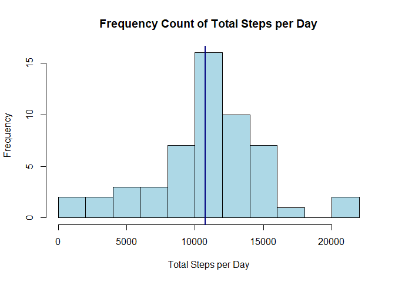
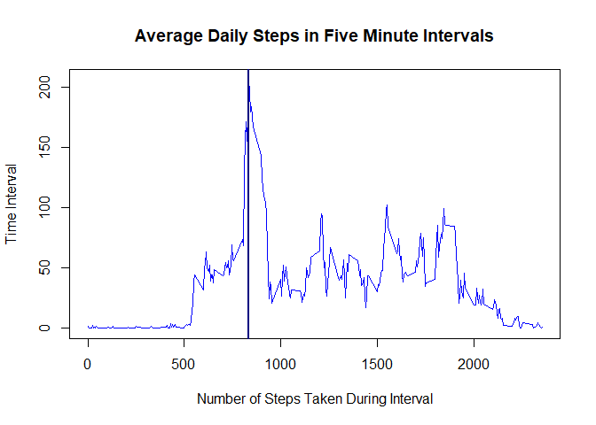

# Reproducible Research: Peer Assessment 1


## Loading and preprocessing the data

Data for this project were supplied from https://d396qusza40orc.cloudfront.net/repdata%2Fdata%2Factivity.zip .

The data consists of two months of data from an anonymous individual collected during the months of October and November, 2012 and include the number of steps taken in 5 minute intervals each day. 

The variables included in this dataset are:

* steps: Number of steps taking in a 5-minute interval (missing values are coded as NA)
* date: The date on which the measurement was taken in YYYY-MM-DD format
* interval: Identifier for the 5-minute interval in which measurement was taken

The dataset is stored in a comma-separated-value (CSV) file and there are a total of 17,568 observations in this dataset. It is initially read into a data.frame called
stepData.


```r
stepData <- read.csv(file = "activity.csv", header = TRUE)
```


## What is mean total number of steps taken per day?

The first step is to sum the steps taken in each five minute interval to get the total steps each day. The aggregate funtion accomplishes this. Please note that missing data are ignored and this could introduce a bias into all calculations. 

Also calculated is the range of the number of steps taken in a day, the mean, and the median.

Next a histogram is plotted that shows the frequency of the number of steps taken each day. 


```r
stepsPerDay <- aggregate(steps ~ date, data=stepData, FUN=sum, na.rm = TRUE)
stepsMeanPerDay <- format(mean(stepsPerDay$steps, na.rm = TRUE), nsmall = 1, scientific = F)
stepsMedianPerDay <- format(median(stepsPerDay$steps, na.rm = TRUE), nsmall = 1, scientific = F)
stepsRangePerDay <- range(stepsPerDay$steps,  na.rm = TRUE)
hist(stepsPerDay$steps, breaks = 14, col = "lightblue", xlab="Total Steps per Day", main = "Frequency Count of Total Steps per Day")
abline(v=median(stepsPerDay$steps),col="navy",lwd=2)
```

<!-- -->

  
The number of steps taken per day varies substantially. The range is between 41 and 21194.
The mean number of steps taken each day is 10766.19, and the median is 10765. Because the mean and median are quite close, they are depicted by the Navy blue line.


## What is the average daily activity pattern?

While the number of steps taken in each 5-minute interval may vary from day to day, there still appears to be some patterns to the activity. The following code creates a time series plot and identifies and plots the interval containing the maximum average number of steps. 


```r
## Calculate the average number of steps in each interval across all days 
stepsPerInterval <- aggregate(steps ~ interval, data = stepData, FUN=mean, na.rm = T)
maxsteps <- format(stepsPerInterval[which.max(stepsPerInterval[,2]),2], nsmall = 1)
maxinterval <- stepsPerInterval[which.max(stepsPerInterval[,2]),1]

if (nchar(maxinterval) == 3) maxtime <- paste0("0",substr(maxinterval,1,1),":",substr(maxinterval,2,3),".00") else maxtime <- paste0(substr(maxinterval,1,2),":",substr(maxinterval,3,4),".00")

## Plot the time series of steps across intervals
with(stepsPerInterval, plot(interval, steps, type="l", xlab = "Number of Steps Taken During Interval", ylab = "Time Interval", main = "Average Daily Steps in Five Minute Intervals", col = "blue"))
abline(v=stepsPerInterval[which.max(stepsPerInterval[,2]),1], col = "navy", lwd = 2)
```

<!-- -->


The average maximum number of steps is 206.1698 which occurred at the interval starting at 08:35.00, and identified with the vertical line.

## Imputing missing values


## Are there differences in activity patterns between weekdays and weekends?
